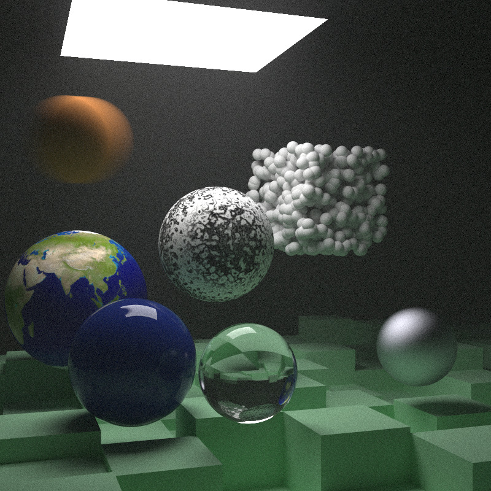
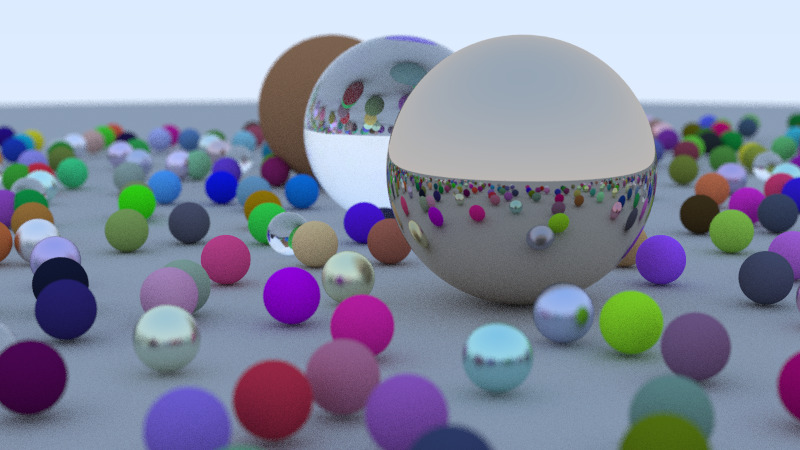

# radiant

## About

A ray tracer created by following the Ray Tracing in One Weekend books
by Peter Shirley (+ added multi-threading support).

## Samples

Here are two samples testing nearly all the ray tracer's features:

- antialiasing
- spheres, rectangles
- diffuse, metal and dielectric surfaces
- motion blur
- solid, perlin noise and image textures
- light sources
- constant density volumes (smoke, fog)
- bounding volume hierarchies
- multi-threading: worker-dispatcher model

*Sample 1 (Ray Tracing: The Next Week)*

*Sample 2 (Ray Tracing in One Weekend)*
